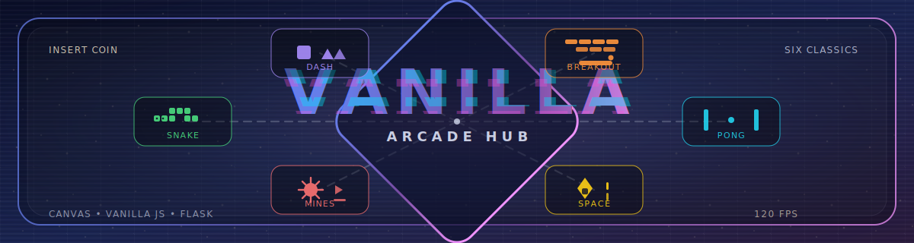

<p align="center">
  
</p>

# Vanilla Collection

[](https://www.python.org/)
[](https://flask.palletsprojects.com/)
[](https://developer.mozilla.org/en-US/docs/Web/HTML)
[](https://developer.mozilla.org/en-US/docs/Web/JavaScript)

A modern web-based collection of simple games featuring 7 classic titles reimagined with HTML5 Canvas, vanilla JavaScript, and a small Python Flask backend.

If you’ve never run a local web project before: you’ll run one Python command to start a local server, then open a link in your browser (Chrome/Firefox/Safari) to play. The backend is optional for gameplay, but enables leaderboards and “helper” endpoints (procedural levels, AI planning) that some games can use.

## 🚀 Quick Start (Play)

1. **Install Python 3.8+**
   - Check it’s installed: `python --version` (or `python3 --version`)
2. **Install the Python dependencies**
   ```bash
   python3 -m venv venv
   source venv/bin/activate  # Windows: venv\Scripts\activate
   pip install -r requirements.txt
   ```
3. **Run the collection**
   ```bash
   python3 app.py
   ```
4. **Play**
   - If a browser tab doesn’t open automatically, go to `http://localhost:5000`
   - Click **Games** → pick a game → choose a difficulty → click **Start** on the game screen

> Tip: You *can* open `index.html` directly, but most browsers restrict some features on `file://` pages (especially `fetch('/api/...')`). Running the server avoids that and gives you the full experience.

## 🎮 Games Included

Each game is a standalone HTML5 Canvas experience with its own intro page, difficulty selection, and persistent local bests. Some games optionally call the Flask backend for AI/procedural content (and fall back to local logic if the backend is offline).

1. **Snake** 🐍 — Grid-based speedrun classic
   - Eat food to grow and rack up points; avoid walls and your own tail.
   - Difficulty tunes the initial tick speed and how quickly the snake accelerates.
   - Optional backend endpoint (`/api/snake/food`) can generate “good” food placement; the game still plays fine without it.

2. **Pong** 🎾 — Readable physics + adaptive opponent
   - Player vs AI with wall bounces, paddle deflections, and pace ramping.
   - AI has reaction delay, aim wobble, and “miss” chance that scale by difficulty (plus an optional backend planner at `/api/pong/ai-target`).
   - Clean HUD and instant restarts make it great for quick matches.

3. **Breakout** 🔨 — Brick clearing with level progression
   - Clear a wall of bricks while keeping the ball in play; lose a life if it falls past the paddle.
   - Level layouts can be generated locally or fetched from the backend (`/api/breakout/level`).
   - Pace increases as you progress, keeping later levels tense without turning random.

4. **Geometry Dash** ⬜ — Fixed-step runner with procedural patterns
   - Endless runner with jump + double-jump timing, plus orbs/portals that change the flow.
   - Obstacle patterns can be generated locally or requested from the backend (`/api/geometry/pattern`).
   - Includes a global leaderboard powered by the Flask score API.

5. **Minesweeper** 💣 — Logic puzzle with modern UX
   - Left-click reveals, right-click flags, double-click “chords” to clear around a number.
   - Board generation can be local or backend-assisted (`/api/minesweeper/board`) for consistent first-click safety.
   - Built to be playable on trackpads/touch with big targets and clear states.

6. **Space Shooters** 🚀 — Wave survival with power-ups
   - Dodge enemy fire, clear waves, and manage survivability (hull/shields).
   - Power-ups (“buds”) temporarily change your weapon (rapid fire / multi-shot).
   - Enemy waves can be generated locally or planned by the backend (`/api/space/wave`).

7. **Tetris** 🧩 — Block-stacking puzzle
   - Full gameplay with hold, ghost piece, scoring, and level speed ramp.
   - Backend configuration endpoint (`/api/tetris/config`) for difficulty tuning.
   - Supports personal bests + global leaderboard via the shared score API.

## ✨ Features

- **Modern Web Interface**: Gradient backgrounds, glass-morphism cards, and consistent HUD styling across the collection and each game.
- **Multiple Difficulty Levels**: Easy/Medium/Hard per game, usually adjusting speed, density, or AI forgiveness rather than just "more enemies".
- **Responsive Design**: Canvases scale with the viewport, keeping gameplay readable on desktop and smaller screens.
- **Sound Effects**: Procedurally generated retro arcade sounds using Web Audio API (`sounds.js`). No audio files needed—all sounds are synthesized in real-time. Toggle sound on/off in-game with the 🔊/🔇 button.
- **Persistent Scores**:
  - Local bests saved with `localStorage` (per game + difficulty).
  - Optional global leaderboards via the Flask server (`/api/leaderboard/<game>`, `/api/score`).
  - Beautiful scoreboard UI component (`scoreboard.js`) with filtering by difficulty.
- **Python Backend (Flask)**: Provides procedural generation helpers and lightweight JSON persistence (defaults to `scores.json` in your user data dir; override with `VANILLA_SCORES_PATH` / `--scores`), but the frontend degrades gracefully when the server is offline.
- **Smooth Gameplay (120 FPS Target)**:
  - Games run a fixed-step 120Hz simulation for consistent timing and input feel.
  - Rendering uses `requestAnimationFrame`, so the visible FPS is capped by your monitor (e.g., 60Hz monitors render at ~60fps, 120/144Hz monitors can render smoother).
- **Full Controls**: Keyboard-first controls, with mouse/touch support where it improves UX (e.g., Minesweeper interactions, Space Shooters steering).

## 📋 Project Structure

```
vanilla/
├── app.py                       # Compatibility shim (runs `vanilla_collection.app`)
├── server.py                    # Compatibility shim (re-exports `vanilla_collection.server`)
├── pyproject.toml               # Packaging + tool configuration
├── requirements.txt             # Python runtime dependencies
├── requirements-dev.txt         # Python dev dependencies
├── scores.example.json          # Example leaderboard file format (optional)
├── tests/                       # Pytest suite
└── vanilla_collection/          # Installable Python package
    ├── app.py                   # Bootstrapper (optionally opens browser)
    ├── cli.py                   # `vanilla-collection` CLI entrypoint
    ├── server.py                # Flask backend + static hosting + score API
    ├── backends/                # Game helper APIs (food, AI, procedural gen)
    └── web/                     # Frontend HTML/CSS/JS assets
        ├── index.html
        ├── games.html
        ├── about.html
        └── <game>/intro.html + <game>/game.html
```

### What are `intro.html` and `game.html`?

- `intro.html` is the “lobby” for a game: it explains the goal, shows the controls, and lets you choose a difficulty.
- `game.html` is the actual game: it renders to a `<canvas>` and runs the game loop.
- Difficulty is passed as a URL parameter like `game.html?difficulty=medium`. If you open a `game.html` directly, it will default to Medium.

## 🧷 What is `favicon.svg`?

A **favicon** is the small site icon that browsers show in places like the tab bar, bookmarks, and “recent sites”. This project uses an SVG favicon so it stays crisp at any size.

In this repo, `favicon.svg` is referenced by basically every page via a `<link rel="icon" ...>` tag (for example: `index.html` uses `favicon.svg`, while game pages use `../favicon.svg`).

It’s not required for gameplay or the backend API — it’s purely branding/UX. If you ever want to remove it, delete the `<link rel="icon" ...>` tags across the HTML files and then delete `favicon.svg`.

## 🔧 Installation

### Requirements
- Python 3.8 or higher
- Flask 2.0+ (installed via `requirements.txt`)

### Setup

1. **Clone the repository**
```bash
git clone https://github.com/yourusername/vanilla.git
cd vanilla
```

2. **Create a virtual environment (recommended)**

A virtual environment keeps this project’s Python packages separate from the rest of your machine.
```bash
python3 -m venv venv
source venv/bin/activate  # On Windows: venv\Scripts\activate
```

3. **Install dependencies**
```bash
pip install -r requirements.txt
```

## ▶️ Running the Application

### Option 1: Using app.py (Recommended)
```bash
python3 app.py
```
This will start the server and (by default) open the collection in your default browser.

- If the browser doesn’t open: visit `http://localhost:5000`
- To stop the server: press `Ctrl+C` in the terminal

### Option 2: Using server.py
```bash
python3 server.py
```
This starts just the server without auto-opening the browser.

The server will start on `http://localhost:5000` by default. Open this URL in your web browser to access the collection.

### Environment Variables (Optional)
- `HOST` - Server host (server.py default: 0.0.0.0, app.py default: 127.0.0.1)
- `PORT` - Server port (default: 5000)
- `DEBUG` - Enable debug mode (default: False)
- `AUTO_OPEN` - Auto-open browser when running app.py (default: 1)

```bash
# Example
HOST=127.0.0.1 PORT=8080 DEBUG=1 python3 server.py
```

## 🎮 Game Controls

### Snake
- **Arrow Keys** or **WASD** - Move the snake
- **Space** - Pause/Resume
- **R** - Restart

### Pong
- **W/S** or **↑/↓** - Move paddle up/down
- **Space** - Serve ball
- **P** - Pause/Resume

### Breakout
- **A/D** or **←/→** - Move paddle left/right
- **Space** - Launch ball
- **P** - Pause/Resume

### Geometry Dash
- **Space/W/↑** - Jump (hold for longer jump, can double-jump)
- **P** - Pause/Resume
- **R** - Restart

### Minesweeper
- **Left Click** - Reveal cell
- **Right Click** - Place/remove flag
- **Double Click** - Chord (auto-reveal adjacent cells)

### Space Shooters
- **A/D** or **←/→** - Move ship left/right
- **Space** - Shoot (or enable autofire with Shift)
- **Shift** - Toggle autofire
- **P** - Pause/Resume

## 🏗️ Architecture

### System Architecture Diagram

```
┌─────────────────────────────────────────────────────────────────────────────────────┐
│                                  🌐 BROWSER                                         │
│  ┌───────────────────────────────────────────────────────────────────────────────┐  │
│  │                            Frontend Layer                                     │  │
│  │                                                                               │  │
│  │   ┌─────────────────┐  ┌─────────────────┐  ┌─────────────────┐               │  │
│  │   │  📄 HTML5 Pages │  │ 🎨 Canvas Games  │  │ ⚡ Vanilla JS    │               │  │
│  │   │  index.html     │  │  (7 modules)    │  │  Game Logic     │               │  │
│  │   │  games.html     │──│  snake/         │──│  UI Controls    │               │  │
│  │   │  about.html     │  │  pong/          │  │  API Calls      │               │  │
│  │   └─────────────────┘  │  breakout/      │  └─────────────────┘               │  │
│  │                        │  geometry_dash/ │                                    │  │
│  │   ┌─────────────────┐  │  minesweeper/   │  ┌─────────────────┐               │  │
│  │   │ 🎨 CSS3 Styles  │  │  space_shooters/│  │ 💾 localStorage  │               │  │
│  │   │  styles.css     │  │  tetris/        │  │  Personal Bests │               │  │
│  │   │  Animations     │  └─────────────────┘  │  Per Game/Diff  │               │  │
│  │   └─────────────────┘                       └─────────────────┘               │  │
│  └───────────────────────────────────────────────────────────────────────────────┘  │
└─────────────────────────────────────────────────────────────────────────────────────┘
                │                         │                         │
                │ HTTP Request            │ Optional API Calls      │ Score Submission
                │ (Static Files)          │ (Procedural Gen)        │ (Leaderboard)
                ▼                         ▼                         ▼
┌─────────────────────────────────────────────────────────────────────────────────────┐
│                            🖥️ FLASK SERVER (Python)                                 │
│  ┌───────────────────────────────────────────────────────────────────────────────┐  │
│  │                              REST API Layer                                   │  │
│  │                                                                               │  │
│  │   ┌─────────────────┐  ┌─────────────────┐  ┌─────────────────┐               │  │
│  │   │ 📁 Static Files │  │ 🏆 Score API     │  │ 🎮 Game APIs    │               │  │
│  │   │  Serve HTML/    │  │  POST /score    │  │  /api/snake     │               │  │
│  │   │  CSS/JS files   │  │  GET /leaderb.  │  │  /api/pong      │               │  │
│  │   └─────────────────┘  └────────┬────────┘  │  /api/breakout  │               │  │
│  │                                 │           │  /api/geometry  │               │  │
│  └─────────────────────────────────│───────────│  /api/minesweep │───────────────┘  │
│                                    │           │  /api/space     │                  │
│                                    │           │  /api/tetris    │                  │
│                                    │           └────────┬────────┘                  │
│                                    ▼                    ▼                           │
│  ┌─────────────────────────────────────────────────────────────────────────────┐   │
│  │                           Backend Modules (backends/)                       │   │
│  │                                                                             │   │
│  │  ┌──────────┐ ┌──────────┐ ┌──────────┐ ┌──────────────┐ ┌──────────────┐   │   │
│  │  │🐍 snake  │ │🎾 pong    │ │🔨 breakout│ │⬜ geometry   │ │💣 minesweeper│   │   │
│  │  │  .py     │ │  .py     │ │   .py    │ │   _dash.py   │ │     .py      │   │   │
│  │  │  Food    │ │  AI      │ │  Level   │ │  Pattern     │ │  Board Gen   │   │   │
│  │  │ Placement│ │ Target   │ │ Layout   │ │  Generation  │ │  First-Safe  │   │   │
│  │  └──────────┘ └──────────┘ └──────────┘ └──────────────┘ └──────────────┘   │   │
│  │                                                                             │   │
│  │  ┌─────────────────┐  ┌─────────────────┐                                   │   │
│  │  │🚀 space_shooters│  │🧩 tetris.py      │                                   │   │
│  │  │     .py         │  │  Difficulty     │                                   │   │
│  │  │  Wave Planning  │  │  Config         │                                   │   │
│  │  └─────────────────┘  └─────────────────┘                                   │   │
│  └─────────────────────────────────────────────────────────────────────────────┘   │
│                                          │                                         │
│                    ┌─────────────────────┴────────────────────┐                    │
│                    │        📊 ScoreStore                     │                    │
│                    │     Thread-safe JSON I/O                 │                    │
│                    │     Read/Write Leaderboards              │                    │
│                    └─────────────────────┬────────────────────┘                    │
└──────────────────────────────────────────│─────────────────────────────────────────┘
                                           │
                                           ▼
                          ┌────────────────────────────────┐
                          │      📁 scores.json            │
                          │    Persistent Leaderboards     │
                          │    Per-game score storage      │
                          └────────────────────────────────┘
```

### Data Flow

```
┌──────────────────────────────────────────────────────────────────────────────────┐
│                              REQUEST/RESPONSE FLOW                               │
└──────────────────────────────────────────────────────────────────────────────────┘

  USER                    BROWSER                   FLASK SERVER              STORAGE
   │                         │                            │                      │
   │  1. Open localhost:5000 │                            │                      │
   │ ───────────────────────>│                            │                      │
   │                         │  2. GET /index.html        │                      │
   │                         │ ──────────────────────────>│                      │
   │                         │                            │                      │
   │                         │  3. Return HTML/CSS/JS     │                      │
   │                         │ <──────────────────────────│                      │
   │                         │                            │                      │
   │  4. Select & Start Game │                            │                      │
   │ ───────────────────────>│                            │                      │
   │                         │                            │                      │
   │                         │  5. Initialize Canvas      │                      │
   │                         │     + Game Loop            │                      │
   │                         │                            │                      │
   │                         │  ┌─────────────────────────────────────────────┐  │
   │                         │  │  IF Backend Available:                      │  │
   │                         │  │                                             │  │
   │                         │  │  6a. POST /api/snake/food (or other API)    │  │
   │                         │  │  ────────────────────────>                  │  │
   │                         │  │                          │                  │  │
   │                         │  │  7a. Generated game data │                  │  │
   │                         │  │  <────────────────────────                  │  │
   │                         │  │                                             │  │
   │                         │  │  ELSE (Backend Offline):                    │  │
   │                         │  │  6b. Use fallback local logic               │  │
   │                         │  └─────────────────────────────────────────────┘  │
   │                         │                            │                      │
   │  8. Play Game...        │                            │                      │
   │ ───────────────────────>│                            │                      │
   │                         │                            │                      │
   │                         │  9. Save personal best     │                      │
   │                         │     to localStorage        │                      │
   │                         │                            │                      │
   │  10. Game Over          │                            │                      │
   │      Submit Score       │                            │                      │
   │ ───────────────────────>│                            │                      │
   │                         │  11. POST /score           │                      │
   │                         │      {game, player, score} │                      │
   │                         │ ──────────────────────────>│                      │
   │                         │                            │  12. Write score     │
   │                         │                            │ ────────────────────>│
   │                         │                            │  (thread-safe)       │
   │                         │                            │ <────────────────────│
   │                         │  13. Updated leaderboard   │                      │
   │                         │ <──────────────────────────│                      │
   │                         │                            │                      │
   │  14. Show leaderboard   │                            │                      │
   │ <───────────────────────│                            │                      │
   │                         │                            │                      │
```

### Frontend
- **HTML5 Canvas** - All game rendering using native Canvas API
- **Vanilla JavaScript** - No frameworks, pure JavaScript for all game logic
- **CSS3** - Modern styling with gradients, animations, and responsive design
- **LocalStorage** - Client-side high score persistence per game/difficulty

### Backend (Python Flask)
- **REST API** - JSON endpoints for game data and leaderboards
- **Procedural Generation** - Server-side generation of game content (obstacles, patterns, levels)
- **AI Logic** - Pong AI targeting calculations
- **Score Management** - Persistent JSON-based score storage with thread-safe operations

### API Endpoints

```
# Core Routes
GET  /                           # Serve homepage
GET  /health                     # Health check
GET  /scores                     # Get all scores
GET  /leaderboard/<game>         # Get leaderboard for specific game
POST /score                      # Submit a new score

# API-prefixed aliases (same functionality, alternative paths)
GET  /api/health                 # Health check (alias)
GET  /api/scores                 # Get all scores (alias)
GET  /api/leaderboard/<game>     # Get leaderboard for specific game (alias)
POST /api/score                  # Submit a new score (alias)

# Game-specific procedural generation endpoints
POST /api/snake/food             # Generate optimal food placement
POST /api/pong/ai-target         # Calculate AI paddle target
POST /api/breakout/level         # Generate breakout level layout
POST /api/geometry/pattern       # Generate obstacle patterns
POST /api/minesweeper/board      # Generate minesweeper board
POST /api/space/wave             # Generate enemy wave configuration
POST /api/tetris/config          # Get Tetris difficulty configuration
```

## 🎨 Design Highlights

- **Gradient Backgrounds**: Purple-blue gradient theme throughout
- **Glass-morphism Effects**: Modern translucent card designs
- **Smooth Animations**: CSS transitions and JavaScript-based game animations
- **Responsive Layouts**: Mobile-friendly with adaptive canvas sizing
- **Consistent Color Scheme**: Professional purple/blue/green palette
- **Typography**: Poppins and Press Start 2P fonts for modern/retro contrast

## 🔧 Customization

### Changing Colors
Edit the color values in `styles.css` or individual game HTML files:
```css
/* Example gradient */
background: linear-gradient(90deg, #667eea, #764ba2);
```

### Adjusting Game Difficulty
Each game has a `CONFIG` object in its game.html file:
```javascript
const CONFIG = {
    easy: { /* parameters */ },
    medium: { /* parameters */ },
    hard: { /* parameters */ }
};
```

### Adding New Games
1. Create a new directory: `newgame/`
2. Add `intro.html` and `game.html` files
3. Implement game logic using Canvas API
4. Add backend module in `backends/newgame.py` if needed
5. Register API endpoint in `server.py`
6. Add game card to `games.html`

## 📊 Performance

- **FPS**: 120 FPS simulation target (fixed 120Hz step); rendering uses requestAnimationFrame and is limited by display refresh rate
- **Memory**: Efficient state management with minimal memory footprint
- **CPU**: Optimized rendering with minimal CPU usage
- **Responsive**: Instant UI responsiveness across all interactions
- **Network**: Optional backend features gracefully degrade when offline

## 🐛 Troubleshooting

### Games not loading
- Ensure Flask server is running on port 5000
- Check browser console for JavaScript errors
- Verify all HTML files are in correct directories

If you see errors like “`GET /api/... 404`”:
- You’re probably opening the HTML directly as a file, or the server isn’t running.
- Start the server (`python3 app.py`) and load the site from `http://localhost:5000`.

### Backend features not working
- Check that Flask server is running: `python3 server.py`
- Verify Python dependencies are installed: `pip install flask`
- Check server console for error messages
- Games will use fallback client-side logic if backend is unavailable

Quick sanity check:
- Open `http://localhost:5000/health` and confirm you get `{ "status": "ok", ... }`

### Performance issues
- Close other browser tabs to free resources
- Disable browser extensions that might interfere
- Try a different browser (Chrome/Firefox recommended)
- Check that hardware acceleration is enabled in browser settings

## 🌐 Browser Compatibility

Tested and working on:
- ✅ Chrome 90+
- ✅ Firefox 88+
- ✅ Safari 14+
- ✅ Edge 90+

## 📝 Technical Details

### Game Loop Pattern
All games use a consistent fixed-step simulation pattern (120Hz) with `requestAnimationFrame` rendering.

What that means in practice:
- The **simulation** advances in fixed, tiny time slices (120 times per second), so physics and input feel consistent even when your laptop is busy.
- The **rendering** (drawing to the screen) happens as fast as your monitor refreshes (usually 60Hz, 120Hz, or 144Hz).
- So you might *see* ~60 FPS on a 60Hz monitor, but the game still *simulates* at 120Hz internally.

Reference pattern:
```javascript
const TARGET_FPS = 120;
const STEP = 1 / TARGET_FPS;
let last = performance.now();
let accumulator = 0;

function loop(now) {
    requestAnimationFrame(loop);
    accumulator += Math.min(0.05, (now - last) / 1000);
    last = now;

    while (accumulator >= STEP) {
        if (state === 'running') update(STEP);
        accumulator -= STEP;
    }

    render();
}

requestAnimationFrame(loop);
```

### Collision Detection
- **AABB (Axis-Aligned Bounding Box)** - For rectangular collision
- **Circle-Rectangle** - For round objects vs rectangles
- **Grid-based** - For Minesweeper tile logic
- **Precise triangle collision** - For Geometry Dash spike detection

### State Management
Each game maintains a state machine:
- `ready` - Initial state, waiting to start
- `running` - Active gameplay
- `paused` - Game paused
- `over` - Game ended

## 🎯 Future Enhancements

- [x] Sound effects *(implemented via Web Audio API in `sounds.js` - procedurally generated retro sounds)*
- [ ] Background music
- [ ] Global online leaderboards with user accounts
- [ ] Additional games (Pac-Man, Asteroids, etc.)
- [ ] Multiplayer network support
- [ ] Achievement system and statistics
- [ ] Customizable key bindings
- [ ] Theme selection (dark/light/custom)
- [ ] Mobile app (PWA) version
- [ ] Game replays and sharing

## 📄 License

This project is provided for educational and entertainment purposes.

## 👨‍💻 Development

Built with:
- **HTML5 Canvas** - Hardware-accelerated 2D graphics
- **Vanilla JavaScript** - Clean, readable, maintainable code
- **CSS3** - Modern responsive design
- **Python Flask** - Lightweight backend framework
- **No external game libraries** - Pure web technologies

## 🙏 Acknowledgments

Vanilla Collection is a modern reimplementation of classic games, created to showcase web development with vanilla technologies and demonstrate how timeless game mechanics can be brought into the modern web era.

---

**Enjoy playing! 🎮**

Visit `/about.html` for more information about the project.
